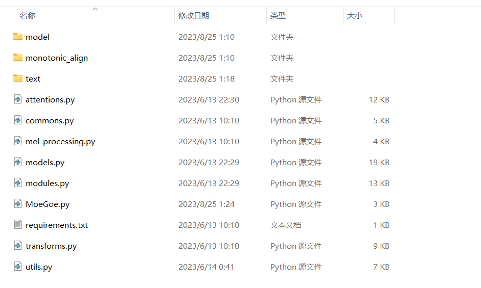

# moevoice
基于HoshinoBot V2的语音生成插件

项目地址：https://github.com/mhy9989/moevoice

仓库部分代码参考自项目 [voice](https://github.com/Yuri-YuzuChaN/voice) 和 [MoeGoe](https://github.com/CjangCjengh/MoeGoe) 

## 使用方法

1. 将该项目放在HoshinoBot插件目录 `modules` 下，或者clone本项目 `git clone https://github.com/mhy9989/moevoice`

2. 通过百度网盘下载语音模型包`model.zip`，将解压后的文件夹`model`放入`moevoice\MoeGoe`目录内

   链接：链接：https://pan.baidu.com/s/12oBG5XpnjjzZonqSaCTrgA?pwd=5oii 
   提取码：5oii

3. 在`moevoice`目录下，使用`pip install -r "requirements.txt"`安装依赖

3. 在 `config/__bot__.py` 模块列表中添加 `moevoice`

4. 重启HoshinoBot

   ***注**：如有问题请提交issue

## 指令说明

- 让[宁宁|爱瑠|芳乃|茉子|丛雨|小春|七海]说
- 让[妃爱|华乃|锦香|诗樱|天梨|和泉|广梦|圣莉]说
- 让[四季|栞那|墨染|爱衣|凉音]说
- 让[穹|目瑛|奈绪|一叶]说
- 让[Sua|Mimiru|Arin|Yeonhwa|Yuhwa|Seonbae]说
- 让[派蒙|凯亚|安柏|丽莎|琴|香菱|枫原万叶|
  迪卢克|温迪|可莉|早柚|托马|芭芭拉|优菈|
  云堇|钟离|魈|凝光|雷电将军|北斗|
  甘雨|七七|刻晴|神里绫华|戴因斯雷布|雷泽|
  神里绫人|罗莎莉亚|阿贝多|八重神子|宵宫|
  荒泷一斗|九条裟罗|夜兰|珊瑚宫心海|五郎|
  散兵|女士|达达利亚|莫娜|班尼特|申鹤|
  行秋|烟绯|久岐忍|辛焱|砂糖|胡桃|重云|
  菲谢尔|诺艾尔|迪奥娜|鹿野院平藏]说
- 让[小暗|茉茉|娜娜|美柑|唯|芽亚|涅墨西斯|静|
  希莉奴|菈菈|沙姫|春菜|ルン|芽衣|恭子|里纱|
  未央|提亚悠九条凛|藤崎绫|结城华|涼子|アゼンダ|梨子|
  梨斗|佩凯|健一|レン|校长]说
- 让[美羽|布良梓|艾莉娜|莉音|尼古拉|小夜|夕里|萌香|安娜|直太|兵马|元树]说
- 让[夏目|栞那|希|爱衣|凉音]说
- 让[姬爱|华乃|日海|诗音|天梨|和泉里|广梦|莉莉子]说
- 让[莲华|雾枝|雫|亚璃子|灯露椎|夕莉]说
- 让[xcw]说
- 让[优妮|切噜|华哥]说
- 让[佩可|可可萝|凯露|雪菲|爱梅斯|惠理子|初音|日和|镜华|美空]说
- 让[桃井|伊吕波|未花|美游|花凛|明日奈|梓|爱丽丝|
    白子|星野|日奈|伊织|泉奈|优香|阿罗那|小春|日富美]说
- 让[黑塔|卡夫卡]说
- **注：**
- 1、上述 `pcr` 和 `ba` 角色支持昵称；
- 2、日语角色语音合成为日语，输入中文自动转换为日语合成

## 更新说明

**2023-08-25**

1. 更新model： `ba` ， `pcr` 
2. 修改架构

**2022-11-05**

1. 版本提交
